# Business Workflow - Mermaid Diagrams

## Main 4-Step Workflow

```mermaid
flowchart TD
    A[👤 Business User<br/>Ask Question in English] --> B{🧠 Smart System<br/>Analyzes Request}
    B --> C[🔧 Auto-Generate<br/>SQL Code]
    C --> D[📊 Execute Query<br/>Get Results]
    
    A1["'Show me high-risk contracts'"] --> A
    B1[🔍 Detects: 'high-risk' + 'contracts'<br/>📊 Selects: compliance_view<br/>🛡️ Applies: security filters] --> B
    C1[SELECT * FROM compliance_view<br/>WHERE risk_level = 'High'<br/>ORDER BY risk_score] --> C
    D1[📋 Contract List<br/>✅ Ready for Action] --> D
    
    style A fill:#e3f2fd,stroke:#1976d2,stroke-width:3px
    style B fill:#f3e5f5,stroke:#7b1fa2,stroke-width:3px
    style C fill:#fff3e0,stroke:#f57c00,stroke-width:3px
    style D fill:#e8f5e8,stroke:#388e3c,stroke-width:3px
```



## SQL Generation Process (Behind the Scenes)

```mermaid
graph TB
    subgraph "🎯 Business Question"
        Q["'Show me high-risk contracts'"]
    end
    
    subgraph "🧠 Smart Translation Engine"
        P1[Pattern Recognition<br/>'high-risk' → risk_level = 'High']
        P2[Data Source Selection<br/>'contracts' → compliance_view]
        P3[Business Rules<br/>Add security filters]
    end
    
    subgraph "📊 Data Knowledge Base"
        K1[Business Dictionary<br/>• high-risk = High Risk Level<br/>• expiring = End Date Soon<br/>• compliance = Status Check]
        K2[Data Source Map<br/>• Contracts → compliance_view<br/>• Sales → sales_database<br/>• HR → employee_data]
    end
    
    subgraph "⚡ Generated SQL"
        SQL[SELECT contract_name, risk_level<br/>FROM compliance_view<br/>WHERE risk_level = 'High'<br/>ORDER BY risk_score DESC]
    end
    
    Q --> P1
    Q --> P2
    P1 --> K1
    P2 --> K2
    K1 --> P3
    K2 --> P3
    P3 --> SQL
    
    style Q fill:#e3f2fd,stroke:#1976d2,stroke-width:3px
    style SQL fill:#e8f5e8,stroke:#388e3c,stroke-width:3px
```



## Permission-Based Results

```mermaid
graph LR
    subgraph "👤 Users"
        U1[Contract Manager]
        U2[Sales Director]
        U3[Executive]
    end
    
    subgraph "🔐 Permission Check"
        PC[Security System<br/>Checks Role & Access]
    end
    
    subgraph "📊 Personalized Results"
        R1[✅ Contract Data<br/>✅ Compliance Info<br/>❌ HR Salaries]
        R2[✅ Sales Data<br/>✅ Customer Info<br/>❌ Contract Details]
        R3[✅ All Data Sources<br/>✅ Cross-Department<br/>✅ Executive Metrics]
    end
    
    U1 --> PC
    U2 --> PC
    U3 --> PC
    
    PC --> R1
    PC --> R2
    PC --> R3
    
    style U1 fill:#fff3e0,stroke:#f57c00,stroke-width:2px
    style U2 fill:#e8f5e8,stroke:#388e3c,stroke-width:2px
    style U3 fill:#f3e5f5,stroke:#7b1fa2,stroke-width:2px
    style PC fill:#ffebee,stroke:#d32f2f,stroke-width:3px
```



## Simple Business Value Flow

```mermaid
flowchart LR
    subgraph "❌ Old Way"
        O1[Business Question] --> O2[Submit IT Ticket]
        O2 --> O3[Wait 3-5 Days]
        O3 --> O4[Get Generic Report]
        O4 --> O5[Request Changes]
        O5 --> O2
    end
    
    subgraph "✅ New Way"
        N1[Business Question] --> N2[Ask in English]
        N2 --> N3[Get Instant Results]
        N3 --> N4[Export to Dashboard]
    end
    
    style O1 fill:#ffebee,stroke:#d32f2f,stroke-width:2px
    style O2 fill:#ffebee,stroke:#d32f2f,stroke-width:2px
    style O3 fill:#ffebee,stroke:#d32f2f,stroke-width:2px
    style O4 fill:#ffebee,stroke:#d32f2f,stroke-width:2px
    style O5 fill:#ffebee,stroke:#d32f2f,stroke-width:2px
    
    style N1 fill:#e8f5e8,stroke:#388e3c,stroke-width:3px
    style N2 fill:#e8f5e8,stroke:#388e3c,stroke-width:3px
    style N3 fill:#e8f5e8,stroke:#388e3c,stroke-width:3px
    style N4 fill:#e8f5e8,stroke:#388e3c,stroke-width:3px
```



## System Intelligence Overview

```mermaid
mindmap
  root((🤖 Smart Query System))
    🧠 Business Intelligence
      📖 Understands Business Terms
        "high-risk" = Risk Level High
        "expiring" = End Date Soon
        "compliance" = Status Check
      🗺️ Knows Data Locations
        Contracts → compliance_view
        Sales → sales_database
        HR → employee_data
    🔐 Security First
      👤 Role-Based Access
      🛡️ Data Filtering
      📊 Personalized Results
    ⚡ Instant Results
      🚀 30 Second Response
      📋 Business-Ready Format
      📊 Export to Dashboards
```



## Technical Architecture (Simplified)


## How to Convert to PNG:

### Option 1: Mermaid Live Editor
1. Go to: https://mermaid.live/
2. Copy any diagram code above
3. Paste into the editor
4. Click "Download PNG"

### Option 2: VS Code Extension
1. Install "Mermaid Preview" extension
2. Create .md file with diagram code
3. Right-click → "Export as PNG"

### Option 3: Command Line
```bash
npm install -g @mermaid-js/mermaid-cli
mmdc -i diagram.md -o diagram.png
```
