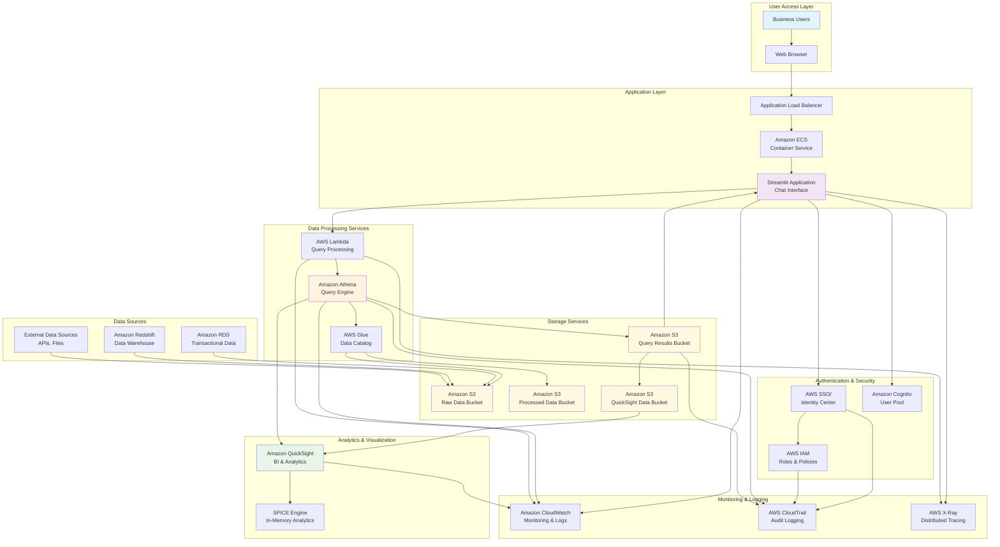
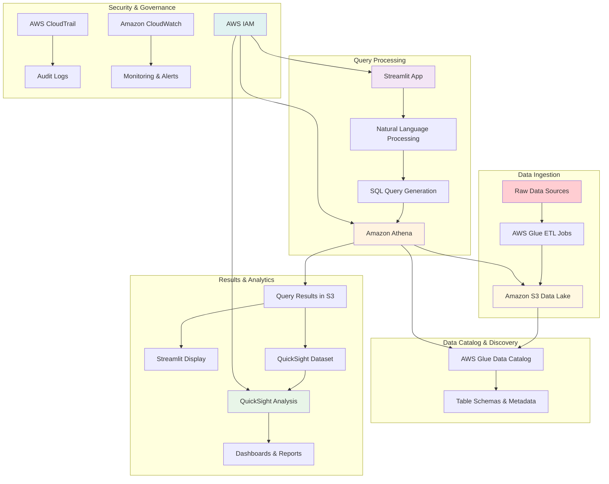
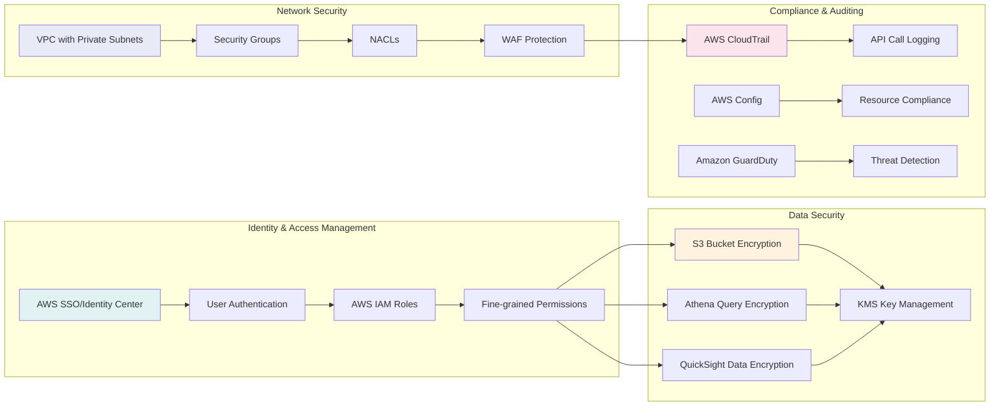
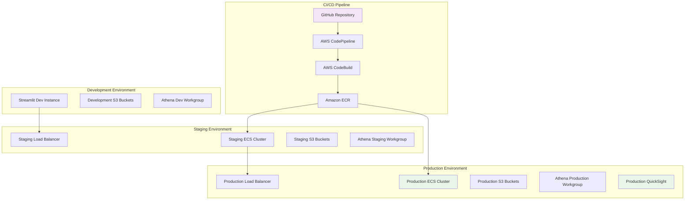

# AWS Architecture Diagram - Athena Query Generator

## Complete AWS Services Architecture

## Data Flow Architecture

## Security & Compliance Architecture

## Cost Optimization Architecture

```mermaid
flowchart TB
    subgraph "Cost Management"
        A[AWS Cost Explorer] --> B[Usage Analytics]
        C[AWS Budgets] --> D[Cost Alerts]
        E[Athena Query Optimization] --> F[Partition Pruning]
        G[S3 Intelligent Tiering] --> H[Storage Cost Optimization]
    end
    
    subgraph "Performance Optimization"
        I[QuickSight SPICE] --> J[In-Memory Performance]
        K[Athena Result Caching] --> L[Query Performance]
        M[S3 Transfer Acceleration] --> N[Data Transfer Speed]
    end
    
    subgraph "Resource Management"
        O[ECS Auto Scaling] --> P[Application Scaling]
        Q[Lambda Concurrency] --> R[Processing Optimization]
        S[CloudWatch Metrics] --> T[Performance Monitoring]
    end
    
    B --> E
    D --> G
    J --> K
    L --> M
    P --> Q
    R --> S
    
    style A fill:#e8f5e8
    style I fill:#fff3e0
    style O fill:#f3e5f5
```

## Deployment Architecture

