# AWS Architecture Diagrams

## Mermaid Diagram - Complete Workflow

```mermaid
graph TB
    %% Users and Access
    BU[👤 Business User<br/>Natural Language Query]
    DA[👨‍💼 Data Analyst<br/>Advanced Queries]
    EX[👔 Executive<br/>Dashboard Access]
    
    %% Streamlit Application
    ST[🚀 Streamlit App<br/>Query Generator<br/>streamlit.app]
    
    %% AWS Services
    ATH[⚡ Amazon Athena<br/>Query Engine<br/>Serverless SQL]
    GLU[🗂️ AWS Glue<br/>Data Catalog<br/>Metadata Store]
    S3D[🗄️ Amazon S3<br/>Data Lake<br/>Raw Data Storage]
    S3R[📁 Amazon S3<br/>Query Results<br/>Processed Data]
    QS[📊 Amazon QuickSight<br/>Business Intelligence<br/>Dashboards & Reports]
    
    %% IAM and Security
    IAM[🔐 AWS IAM<br/>Access Control<br/>Cross-Account Roles]
    
    %% User Flow
    BU --> ST
    DA --> ST
    EX --> ST
    
    %% Application Flow
    ST -->|1. Authenticate| IAM
    ST -->|2. Generate SQL| GLU
    ST -->|3. Execute Query| ATH
    ATH -->|4. Scan Data| S3D
    ATH -->|5. Store Results| S3R
    ST -->|6. Display Results| ST
    ST -->|7. Export Data| QS
    
    %% Data Catalog Integration
    GLU -->|Schema Info| ATH
    GLU -->|Table Metadata| S3D
    
    %% QuickSight Integration
    QS -->|Read Results| S3R
    QS -->|Query Direct| ATH
    QS -->|Access Catalog| GLU
    
    %% Security Layer
    IAM -->|Secure Access| ATH
    IAM -->|Permissions| S3D
    IAM -->|Role-Based| QS
    
    %% Styling
    classDef userClass fill:#e1f5fe,stroke:#01579b,stroke-width:2px
    classDef appClass fill:#f3e5f5,stroke:#4a148c,stroke-width:3px
    classDef awsClass fill:#fff3e0,stroke:#e65100,stroke-width:2px
    classDef securityClass fill:#ffebee,stroke:#b71c1c,stroke-width:2px
    
    class BU,DA,EX userClass
    class ST appClass
    class ATH,GLU,S3D,S3R,QS awsClass
    class IAM securityClass
```

## Simplified Block Diagram

```mermaid
flowchart LR
    %% User Layer
    U[👤 Business Users<br/>Ask Questions in English]
    
    %% Application Layer
    A[🚀 Streamlit App<br/>• Natural Language Processing<br/>• Smart Query Generation<br/>• Multi-Account Support]
    
    %% AWS Data Layer
    subgraph AWS["🏗️ AWS Data Platform"]
        direction TB
        G[🗂️ AWS Glue<br/>Data Catalog]
        AT[⚡ Amazon Athena<br/>Query Engine]
        S[🗄️ Amazon S3<br/>Data Lake]
        Q[📊 QuickSight<br/>Visualization]
    end
    
    %% Flow
    U -->|"Show me high-risk contracts"| A
    A -->|Generated SQL| AT
    AT <-->|Schema| G
    AT <-->|Data| S
    A -->|Results| Q
    Q -->|Dashboards| U
    
    %% Styling
    classDef userStyle fill:#e3f2fd,stroke:#1976d2,stroke-width:3px
    classDef appStyle fill:#f3e5f5,stroke:#7b1fa2,stroke-width:3px
    classDef awsStyle fill:#fff8e1,stroke:#f57c00,stroke-width:2px
    
    class U userStyle
    class A appStyle
    class G,AT,S,Q awsStyle
```

## Enterprise Multi-Account Architecture

```mermaid
graph TB
    %% Users
    subgraph Users["👥 Enterprise Users"]
        BU[Business Users]
        IT[IT Administrators]
        EX[Executives]
    end
    
    %% Application
    APP[🚀 Athena Query Generator<br/>Streamlit Cloud<br/>Password Protected]
    
    %% Multi-Account Structure
    subgraph AWS["🏢 AWS Organization"]
        subgraph ACC1["🏦 Production Account<br/>695233770948"]
            ATH1[Athena]
            GLU1[Glue Catalog]
            S31[S3 Data Lake]
            QS1[QuickSight]
        end
        
        subgraph ACC2["🧪 Development Account<br/>476169753480"]
            ATH2[Athena]
            GLU2[Glue Catalog]
            S32[S3 Data Lake]
            QS2[QuickSight]
        end
        
        IAM[🔐 Cross-Account IAM<br/>Federated Access]
    end
    
    %% Connections
    Users --> APP
    APP --> IAM
    IAM --> ACC1
    IAM --> ACC2
    
    %% Data Flow
    APP -.->|Account 1| ATH1
    APP -.->|Account 2| ATH2
    ATH1 --> S31
    ATH2 --> S32
    GLU1 --> ATH1
    GLU2 --> ATH2
    
    %% Styling
    classDef prodStyle fill:#e8f5e8,stroke:#2e7d32,stroke-width:2px
    classDef devStyle fill:#fff3e0,stroke:#f57c00,stroke-width:2px
    classDef appStyle fill:#f3e5f5,stroke:#7b1fa2,stroke-width:3px
    
    class ACC1,ATH1,GLU1,S31,QS1 prodStyle
    class ACC2,ATH2,GLU2,S32,QS2 devStyle
    class APP appStyle
```

## Data Flow Sequence

```mermaid
sequenceDiagram
    participant U as 👤 Business User
    participant S as 🚀 Streamlit App
    participant I as 🔐 AWS IAM
    participant G as 🗂️ AWS Glue
    participant A as ⚡ Amazon Athena
    participant D as 🗄️ S3 Data Lake
    participant R as 📁 S3 Results
    participant Q as 📊 QuickSight
    
    U->>S: "Show me high-risk contracts"
    S->>I: Authenticate with AWS
    I-->>S: Access granted
    S->>G: Get table schemas
    G-->>S: Return metadata
    S->>S: Generate SQL query
    S->>A: Execute SQL
    A->>D: Scan contract data
    D-->>A: Return data rows
    A->>R: Store query results
    A-->>S: Query completed
    S-->>U: Display results table
    U->>S: Export to QuickSight
    S->>Q: Create dataset
    Q->>R: Read query results
    Q-->>U: Dashboard ready
```

## Cost and Performance Metrics

```mermaid
graph LR
    subgraph Metrics["📊 Performance & Cost"]
        T[⏱️ Query Time<br/>30 seconds avg]
        C[💰 Cost per Query<br/>$0.05 - $0.50]
        S[📈 Scalability<br/>1000+ concurrent users]
        A[🎯 Accuracy<br/>95%+ SQL generation]
    end
    
    subgraph Benefits["✅ Business Benefits"]
        R[🚀 99% Time Reduction<br/>Days → Seconds]
        U[👥 300% User Adoption<br/>Self-service analytics]
        D[📊 Real-time Decisions<br/>vs Weekly reports]
        I[💡 Democratized Data<br/>No SQL required]
    end
    
    Metrics --> Benefits
```

