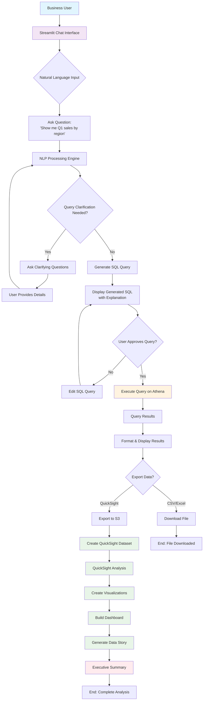
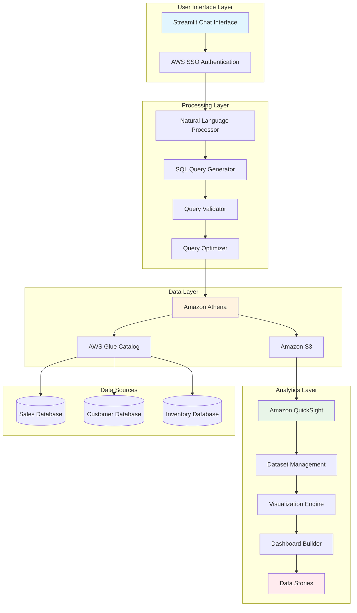
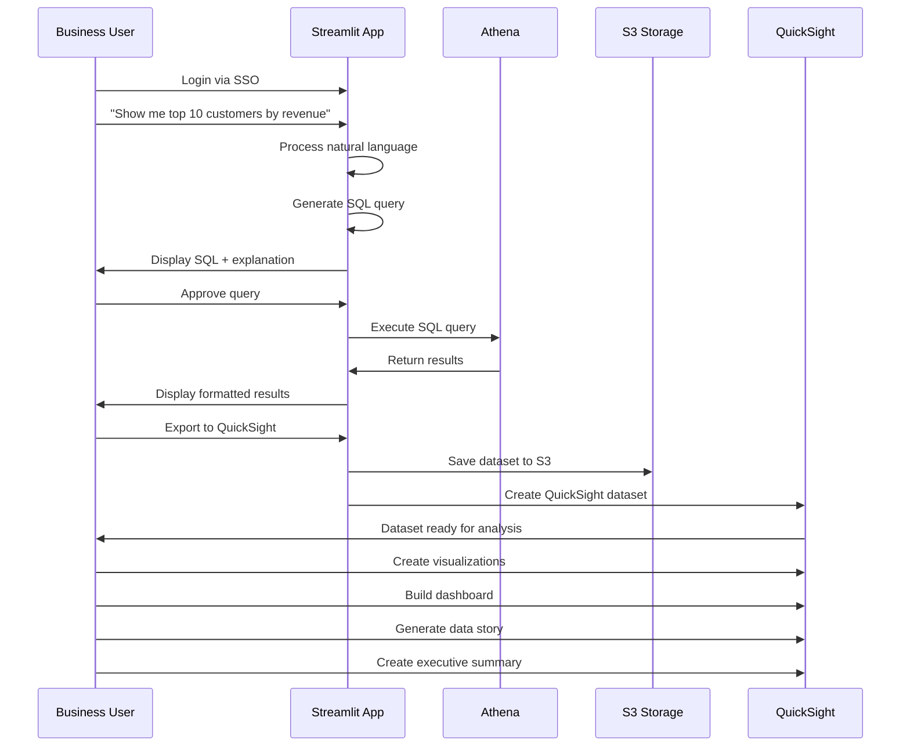

# Business User Workflow - Natural Language to QuickSight Visualizations

## Complete User Journey Diagram

## Detailed Component Architecture

## User Interaction Flow

## QuickSight Integration Workflow

```mermaid
flowchart LR
    subgraph "Streamlit Application"
        A[Query Results] --> B[Data Validation]
        B --> C[Format for Export]
        C --> D[Export Options]
    end
    
    subgraph "Data Transfer"
        D --> E[Save to S3 Bucket]
        E --> F[Generate Manifest File]
        F --> G[Trigger QuickSight Import]
    end
    
    subgraph "QuickSight Processing"
        G --> H[Create Dataset]
        H --> I[Data Preparation]
        I --> J[Schema Detection]
        J --> K[Data Types Mapping]
    end
    
    subgraph "Visualization Creation"
        K --> L[Analysis Creation]
        L --> M[Chart Selection]
        M --> N[Visual Configuration]
        N --> O[Dashboard Assembly]
    end
    
    subgraph "Reporting & Sharing"
        O --> P[Data Story Creation]
        P --> Q[Executive Summary]
        Q --> R[Share & Collaborate]
    end
    
    style A fill:#f3e5f5
    style E fill:#fff3e0
    style H fill:#e8f5e8
    style L fill:#e8f5e8
    style P fill:#ffebee
```

